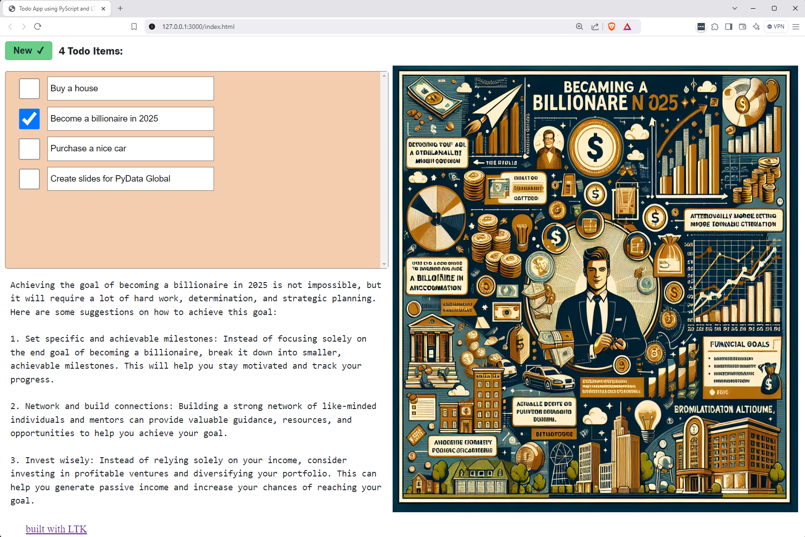

# Todo App written using PyScript LTK

## Main Features

- Persistence of to-do items in `window.localStorage`, using `ltk.LocalStorageModel`
- Usage of Reactive LTK for rendering todo items and application summary
- Layout using `SplitPanel`, `VBox` and `HBox`
- Styling done in CSS using automatically generated classes for model elements.
- Retrieval from OpenAI for suggestions and images for to-do items.
- The app has 70 lines of Python code (removing blank lines and comments).
- OpenAI helper functions, with caching, measure 70 lines as well.

## Sample Screenshot

