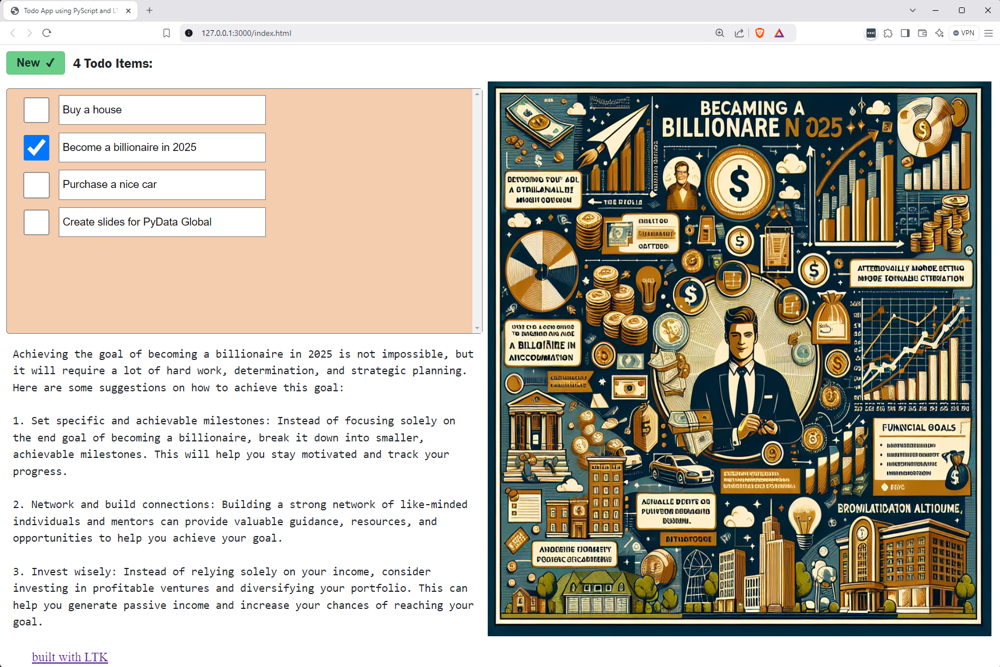

# Todo App written using PyScript LTK

## Live Demo

Watch the todo app on [GitHub Pages at laffra.github.io/todo/](https://laffra.github.io/todo/).

## Main Features

- Persistence of to-do items in `window.localStorage`, using `ltk.LocalStorageModel`
- Usage of Reactive LTK for rendering todo items and application summary
- Layout using `SplitPanel`, `VBox` and `HBox`
- Styling done in CSS using automatically generated classes for model elements.
- Retrieval from `OpenAI` for suggestions and images for to-do items.
- The app only has 70 lines of Python code when blank lines and comments are removed.
- OpenAI helper functions, including caching support, measure 70 lines as well.

## Sample Screenshot

